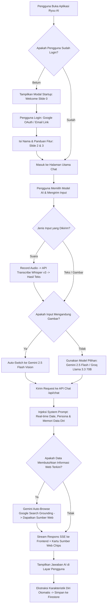

# Dokumentasi dan Panduan Presentasi Ryuu AI

> **Ryuu AI — AI Chat for Everyone**  
> *Asisten Percakapan Cerdas Multimodal, Responsif, dan Personalisatif dengan Integrasi Real-Time Web Search.*

---

## 1. Definisi Produk

**Ryuu AI** adalah sebuah platform asisten kecerdasan buatan (AI Chatbot) modern yang dirancang untuk membantu pengguna menyelesaikan berbagai kebutuhan harian—mulai dari memecahkan masalah koding yang rumit, membantu riset akademis, hingga analisis dokumen dan gambar secara visual.

Dengan filosofi **"AI Chat for Everyone"**, Ryuu AI hadir dengan antarmuka yang sangat intuitif, cepat, bersih dari iklan, serta dilengkapi kemampuan mengingat karakteristik pengguna secara alami (AI Personal Memory).

---

## 2. Versi Teknologi (Tech Stack Versions)

### Frontend (Antarmuka Pengguna)
- **Next.js**: v16.2.10 (App Router dengan Turbopack Engine)
- **React**: v19.0.0
- **React DOM**: v19.0.0
- **TypeScript**: v5.7.0
- **React Markdown**: v9.1.0 (Render format teks AI)
- **Remark GFM**: v4.0.1 (Dukungan tabel dan markdown extended)
- **Vanilla CSS3**: Styling kustom tanpa dependensi CSS eksternal

### Backend dan SDK AI
- **Google GenAI SDK (`@google/genai`)**: v2.13.0
- **Groq SDK (`groq-sdk`)**: v0.12.0
- **Firebase Web SDK (`firebase`)**: v12.16.0
- **Node.js Environment**: v22.x

---

## 3. Layanan API dan Spesifikasi Model

1. **Google GenAI API (`@google/genai` v2.13.0)**:
   - **Model**: `gemini-2.5-flash`
   - **Fungsi**: Pemrosesan multimodal utama (analisis gambar/vision, dokumen), serta Google Search Grounding.
2. **Groq LPU Engine (`groq-sdk` v0.12.0)**:
   - **Model Teks**: `llama-3.3-70b-versatile` (Respons teks super cepat)
   - **Model Suara**: `whisper-large-v3` (Transkripsi audio Speech-to-Text)
3. **Google Search Grounding API**:
   - Menghubungkan model Gemini secara langsung ke mesin pencari Google untuk mendapatkan rujukan informasi web terkini.

---

## 4. Alur Pemakaian AI Pengguna (User Interaction Flow)

Diagram di bawah ini menggambarkan alur lengkap saat pengguna berinteraksi dengan aplikasi Ryuu AI:

### Penjelasan Langkah Alur:
1. **Autentikasi dan Onboarding**: Pengguna baru disambut oleh modal startup dan login menggunakan Google OAuth atau Email Link.
2. **Input Multimodal**: Pengguna bisa mengetik teks, mengunggah foto/gambar, atau berbicara via rekaman suara yang diubah menjadi teks oleh Groq Whisper v3.
3. **Routing Model Otomatis**: Jika pesan mengandung gambar, sistem otomatis mengarahkan pemrosesan ke **Gemini 2.5 Flash**. Jika pesan hanya berupa teks, sistem menggunakan model sesuai pilihan pengguna (Gemini / Groq Llama 3.3 70B).
4. **Context Injection & Search Grounding**: Server menginjeksi waktu lokal real-time dan memori data diri pengguna. Jika pertanyaan membutuhkan fakta terkini, Gemini melakukan pencarian web Google secara otomatis dan mengirimkan sumbernya.
5. **Streaming & Memory Loop**: Jawaban dikirim ke layar pengguna secara streaming real-time (Server-Sent Events), dan sistem secara otomatis memperbarui ingatan data diri pengguna ke database Firestore.

---

## 5. Fitur-Fitur Unggulan

### Multimodal dan Input Fleksibel
- **Teks dan Kode Program**: Memahami dan menghasilkan kode profesional dengan tampilan terminal bergaya macOS yang bisa disalin (copy code) dalam sekali klik.
- **Analisis Gambar dan Vision**: Mampu melihat dan menganalisis foto, diagram, tabel, hingga tangkapan layar (screenshot error) menggunakan model multimodal Gemini 2.5 Flash.
- **Perekam Suara dan Transkripsi (Whisper)**: Pengguna bisa langsung berbicara menggunakan suara; sistem akan mentranskripsi percakapan secara akurat dan menyaring suara yang hening/tanpa suara (silence filter).

### Search Grounding dan Akses Informasi Real-Time
- **Pencarian Web Otomatis**: Jika pertanyaan membutuhkan informasi terkini (misalnya berita terbaru atau data di atas cutoff pelatihan), AI akan browsing Google secara otomatis dan menyajikan **kartu sumber web (source chips)** yang bisa langsung diklik.
- **Kesadaran Waktu (Time Awareness)**: AI selalu mengetahui hari, tanggal, jam, dan zona waktu (WIB, UTC+7) secara tepat sehingga tidak mengalami kesalahan konteks temporal.

### Ingatan Data Diri Pengguna (AI Personal Memory)
- AI mampu mengekstrak latar belakang pengguna (seperti nama, bidang pekerjaan/sekolah, domisili, hingga preferensi bahasa) dari percakapan secara otomatis dan menyimpannya secara aman di Cloud Firestore. Pengguna tidak perlu mengulang informasi diri di percakapan berikutnya.

### Desain dan UX Kelas Atas
- **Tema Gelap dan Terang (Dark/Light Mode)**: Desain modern berbasis glassmorphism yang nyaman di mata.
- **Responsif Seluruh Perangkat**: Pengalaman pemakaian yang mulus di desktop, tablet, maupun layar smartphone (skala otomatis 90% di perangkat seluler).
- **Multi-Model Provider Switch**: Pengguna bebas memilih model AI yang ingin digunakan (Gemini 2.5 Flash atau Groq Llama 3.3 70B).

---

## 6. Tahapan Pembuatan Aplikasi

1. **Perencanaan dan Konsep UX/UI**: Merancang identitas visual Ryuu AI, alur onboarding pengguna baru, serta antarmuka ruang obrolan yang bersih dan bebas iklan.
2. **Setup Fondasi dan Design System**: Mengonfigurasi Next.js 16 dengan sistem token CSS kustom untuk tema gelap/terang, kartu kode macOS, dan tata letak responsif.
3. **Autentikasi dan Database**: Mengintegrasikan Firebase Auth (Google Sign-In) dan Firestore untuk menyimpan riwayat chat secara otomatis di cloud.
4. **Pengembangan API Engine**: Membangun endpoint `/api/chat` dengan dukungan Server-Sent Events (SSE) untuk menghasilkan efek teks mengetik secara real-time.
5. **Integrasi Voice dan Multimodal**: Menambahkan pengolah audio browser (AudioWorklet/MediaRecorder) dan endpoint `/api/transcribe` dengan filter keheningan (silence filter).
6. **Integrasi Search Grounding dan Real-Time Context**: Menambahkan alat pencarian web Google dan penanda waktu lokal agar AI tidak buta waktu.
7. **Keamanan dan Optimasi**: Mempasang security headers, sanitasi input dari XSS, serta pembatasan payload agar database tidak kelebihan beban.

---

## 7. Keunggulan dan Manfaat Aplikasi

### Bagi Pengguna (User Benefits)
- **Produktivitas Meningkat**: Membantu menyelesaikan tugas, membuat artikel, dan memahami materi pembelajaran jauh lebih cepat.
- **Jawaban Selalu Akurat dan Terkini**: Karena didukung oleh pencarian Google langsung, pengguna mendapatkan informasi segar tanpa khawatir terikat masa lalu (cutoff data).
- **Pengalaman Personalisasi Nyaman**: AI menyapa dan merespons pengguna sesuai karakter dan latar belakang pengguna tanpa perlu mengulang penjelasan.
- **Privasi dan Keamanan Terjamin**: Bebas dari pelacak iklan komersial; data profil dan riwayat percakapan tersimpan aman.

### Keunggulan Teknis (Technical Highlights)
- **Performa Responsivitas Kilat**: Penggunaan streaming SSE memastikan respons pertama muncul hanya dalam hitungan milidetik.
- **Bebas Error Skala Layar**: Aplikasi dapat berjalan lancar di HP dengan ukuran layar apapun tanpa terpotong (responsive scaling).
- **Hemat Penyimpanan**: Sistem secara otomatis mengompresi dan menyaring data gambar berukuran besar agar database tetap efisien dan tidak overload.

---

> *Dokumen ini dibuat untuk bahan penyusunan Slide Presentasi (PPT) Ryuu AI.*
